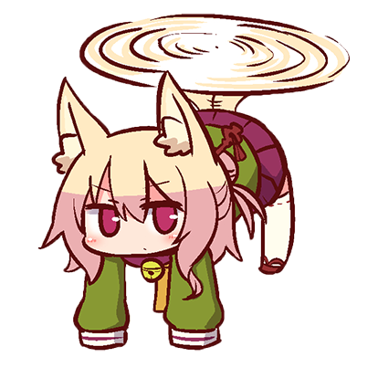
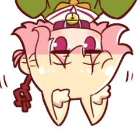

  
  
# 🐱 VencordPlugins
My own list of plugins I made. They're not big since I have other projects that I work on, but I'm gonna make some in future.

> [!NOTE]
> Third party plugins are **NOT** supported by Vencord developers and you should proceed with caution when using them! Also please **do not ask them for help with custom plugins, it will get you most likely muted**.

> [!CAUTION]
> [Vencord](https://github.com/Vendicated/Vencord) is a mod for Discord which breaks TOS, though Discord doesn't ban for it. If you really care about your account then better don't use it.

## 💻 Plugins included:
- [remixMe](remixMe/index.tsx) - Adds **REMIX** tag to every message of your that has any sort of attachment, not only image.  
- [meowmrrp](meowmrrp/index.tsx) - Sends phrases like `meow` or `mrrp` on your current chat with reasonable delay. (More about how it works in plugin's settings) 

## 💬 Upcoming Plugins:
`-`

## ❌ Removed Plugins (+ reason):
- noAppsAllowed - Useless + easily breakable plugin. You can easily find a CSS snippet that replaces this.
- betterQuests - Unusable - would crash Discord on start with it, since that time Discord already put quests in a *bit* better place (`Discover > Quests`)

## ❔ How to install third party plugins?
https://docs.vencord.dev/installing/custom-plugins/

